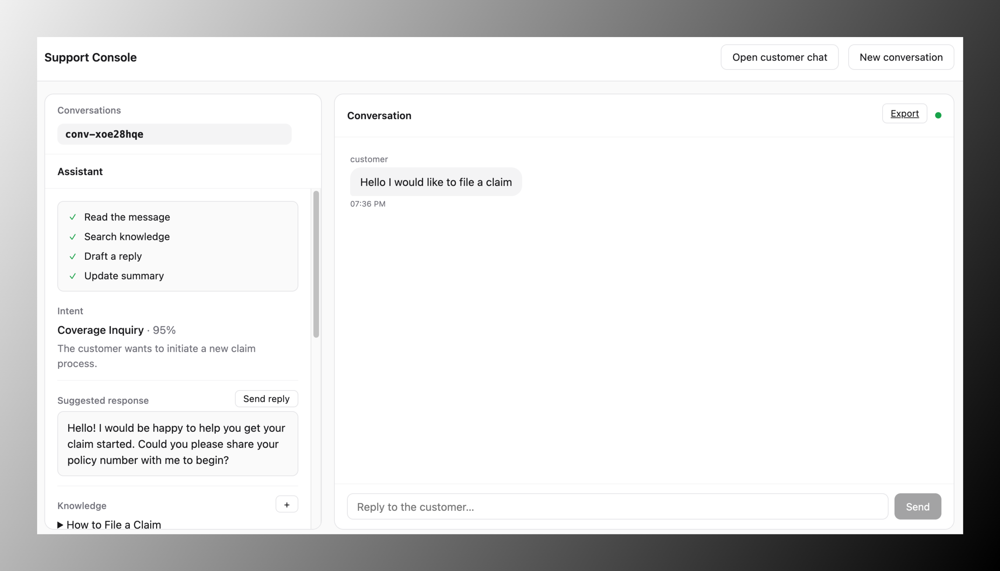
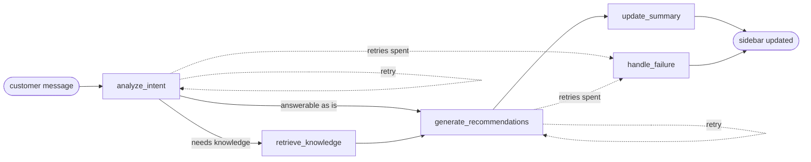

# Real-Time Support Agent Assistant

The goal of this application to develop a simple chat interface to display the autonomous support "Co-pilot" system that can be used by the claims agent to understand the claim that they are processing - to make more informed business decisions, speed up SLA and ultimately to provide and more unique Customer Experience with AI

The stack is LangGraph for the orchestration, FastAPI for the backend, and React for the frontend. The two containers run on ECS. IaC that will be used is Terraform and basic CI/CD using Github Actions

The goal is not to overcomplicate the setup. Rather to show the most viable product for the Interview Assessment

## Interface

The frontend is a Vite and React app in two panels: the conversation on the right, the assistant sidebar on the left.

The sidebar is what the claims agent reads while they talk to the claimant. It updates in real time as the workflow runs — the detected intent and its confidence, a suggested reply the agent can send as is, the knowledge articles the answer came from, the information still missing from the claim, the next action, and a running summary.

"Open customer chat" in the top right opens the claimant's side in a new tab. Send a message from there to try it out: each step of the workflow lands in the sidebar as it finishes.



## Operation

Each conversation is one LangGraph workflow, and every customer message starts a run.




Knowledge retrieval is skipped when the intent step decides the message is answerable without it. A node that errors retries up to `MAX_RETRIES`, then falls through to `handle_failure` so the run always ends cleanly.

The agent console shows the conversation and the sidebar. The button "Open customer chat" opens the customer view in a new tab. The two views use the same conversation and their own WebSocket connections.

## Repository

```
backend/    FastAPI and LangGraph service
frontend/   
terraform/  AWS infrastructure
docs/       design.md: architecture, workflow design, security, and operations
.github/    CI actions
```


## Local operation

You need an [OpenRouter](https://openrouter.ai) API key.

```bash
cp backend/.env.example backend/.env   # put your OPENROUTER_API_KEY in this file
make dev                               # open http://localhost:3000
```

Common commands:


| Command    | Action                                 |
| ---------- | -------------------------------------- |
| `make dev` | build and run both containers on :3000 |


## Infrastructure

Two ECS Fargate services in one VPC

```
terraform/bootstrap/   S3 state bucket, GitHub role, ECR repositories, API key secret
terraform/             VPC, ECS, IAM, logs, secrets (applied by CI)
```


### First deployment

```bash
# 1. Creates the state bucket, the ECR repositories, the deploy role and the empty Secrets Manager entry for the API key.
cd terraform/bootstrap
terraform init && terraform apply -var github_repository=<owner>/<repo>
terraform output          # deploy_role_arn and state_bucket, needed in step 2

# 2. in GitHub, add the secrets AWS_DEPLOY_ROLE_ARN and TF_STATE_BUCKET, variable AWS_REGION, and a "production" environment.
#    Both deploy jobs are skipped if AWS_REGION is unset.

# 3. store the API key in AWS SecretsManager
aws secretsmanager put-secret-value --region <region> \
  --secret-id agent-workflow/openrouter-api-key --secret-string '<OPENROUTER_API_KEY>'

# 4. push to main
```

The Deploy workflow builds both images, applies `terraform/`, and waits for the
services to stabilize. 

Its last step prints the console URL, `http://<ip>:8080` the frontend runs on a public IP with no load balancer

