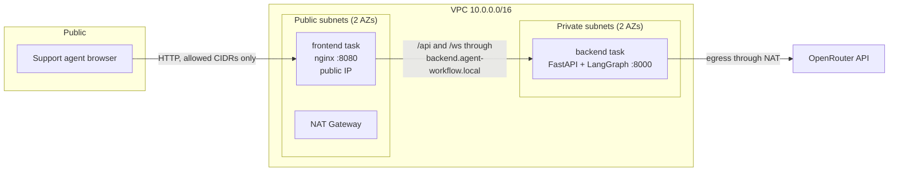
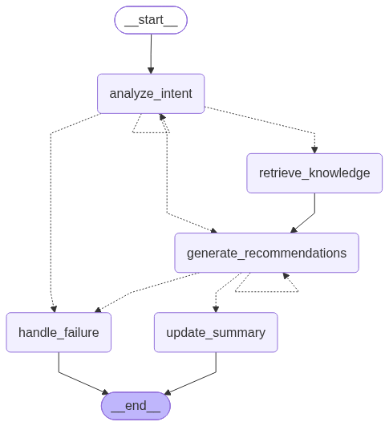

# Design Document

1. [Architecture](#1-architecture)
2. [LangGraph workflow](#2-langgraph-workflow)
3. [Security](#3-security)
4. [CI/CD and operations](#4-cicd-and-operations)
5. [Tradeoffs and limits](#5-tradeoffs-and-limits)

---

# 1. Architecture

Frontend and Backend are two independent ECS services

The frontend is nginx with the React application in a public subnet

The backend is FastAPI with the LangGraph workflow in a private subnet

The frontend proxies `/api` and `/ws` to the backend

## Network

| Item | Choice |
|---|---|
| Ingress | Frontend public IP, port 8080, `allowed_ingress_cidrs` only |
| Frontend to backend | Cloud Map private DNS, `backend.agent-workflow.local` |
| Backend | Private subnets, port 8000 from the frontend security group only |
| Egress | One NAT gateway for ECR, CloudWatch, and OpenRouter |
| TLS | HTTP only. Production adds an ALB with an ACM certificate |

Security group chain: `allowed_ingress_cidrs -> frontend-sg:8080 -> backend-sg:8000`. Access to the backend can only be reached via the security group of frontend

## Observability

- Persist logs in AWS Cloudwatch under these namespace - `/ecs/agent-workflow/frontend` and `/ecs/agent-workflow/backend`
- Each run logs its start and end with the `conversation_id` and a short `run_id`. A node failure logs a traceback

---

# 2. LangGraph workflow

The design that I have chosen is a simple stateful workflow that first analyses the intent from the message and decides which node to move on to. This is done via the conditional edge that routes the decisions to either the retrieval, recommendation, failure node and the node itself if no definitive routing can be made. 

Each node is checkpointed in the memmory and can be accessed by the thread_id

| Node | Type | Function |
|---|---|---|
| `analyze_intent` | LLM | Intent classification |
| `retrieve_knowledge` | deterministic | Keyword search over documents |
| `generate_recommendations` | LLM | Draft reply, necessary information, next action |
| `update_summary` | LLM | Short summary of the conversation |
| `handle_failure` | deterministic | Reduced sidebar when a node fails |

## Memory

- `messages` uses an append reducer that the checkpointer keeps, so each run sees the full conversation.
- The last 20 messages go without change. The function `update_summary` adds the summary into the previous conversations
- At the moment there is no Long Term Memory as it might be a scope creep in the assessment

---

# 3. Security

- **Network.** The backend service has no public IP and no internet route. Only the frontend security group reaches port 8000. 
- **IAM.** Each service has its own execution role. Only the backend service is able to read the secrets from the Secrets Manager
- **Secrets.** The API keys are managed here

---

# 4. CI/CD and operations

| Workflow | Trigger | Steps |
|---|---|---|
| `ci.yml` | pull request, push to `main` or `uat` | ruff, pytest, frontend lint and build, Terraform `fmt -check` and `validate` |
| `deploy.yml` | push to `main` | OIDC role, build and push both images tagged with the Git SHA, `terraform apply` with that tag, wait for `ecs services-stable`, print the URL |

The apply releases the infrastructure and the application together, so Terraform and ECS keep the same task definitions.

First installation:

1. `terraform apply` in `terraform/bootstrap` makes the state bucket, the CI role, and the ECR repositories. The repositories live here because images must exist before the root stack can create the services that use them.
2. In GitHub, set the secrets `AWS_DEPLOY_ROLE_ARN` and `TF_STATE_BUCKET`, the variable `AWS_REGION`, and the `production` environment.
3. Put the API key in Secrets Manager with `aws secretsmanager put-secret-value`.
4. Push to `main`. The pipeline builds the images, pushes them, and applies the root stack.

Run the `application_url_command` output to get the console address. `terraform destroy` removes everything.

---

# 5. Tradeoffs and limits

**1. Conversation state is in memory.** The LangGraph checkpointer is stored in memory. Ideally you would want to have both short term (langGraph checkpointer) and long term memory. 

For Production - Short term memory are informations that is stored in the context window of the LLM which is useful per session. Long term memory are informations that persist across different sessions and typically stored on S3 or DynamoDB

**2. No Load Balancer on ingress.** The frontend runs as one task with a public IP on HTTP, because the assignment has no domain and no certificate. 

For Production, put an ALB in front of the frontend with an ACM certificate and an HTTPS listener